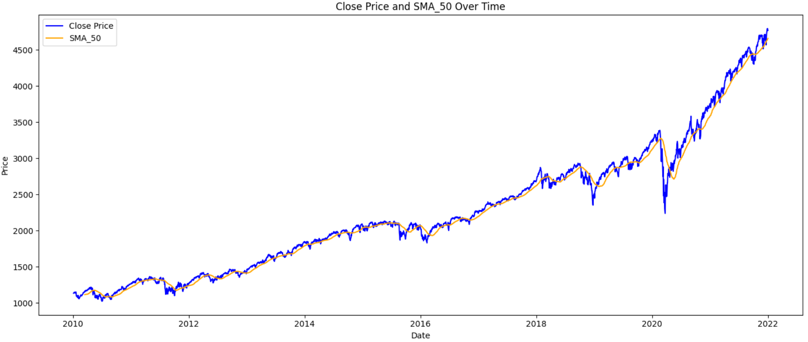
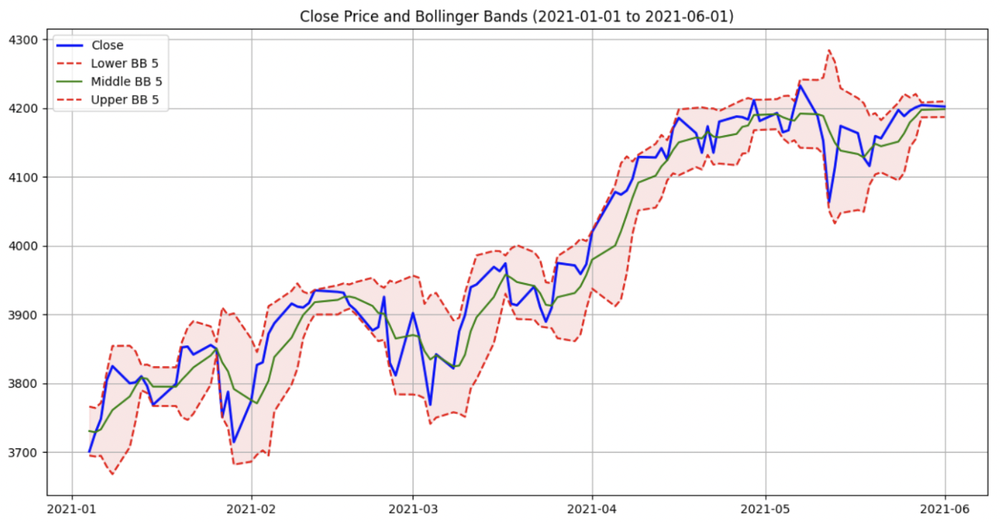

# S&P 500 and AAPL Stock Price Prediction Model 
### Created by Sean McDermott, Haran Eiger, and Jon Cook.

# Data sets:
> https://pypi.org/project/yfinance/
>
> https://www.kaggle.com/datasets/lorilaz/apple-news-headline-sentiment-and-stock-info 

# Introduction
The stock market is defined by its non-linear data patterns and its unpredictability. Despite its complexities and the widely accepted Efficient Market Hypothesis, which claims that it is almost impossible to consistently outperform the market without insider information, there is substantial value in developing models that can predict market movements. This project focuses on using various financial indicators to predict the S&P 500 change in magnitude and direction.<br><br>

Our project aimed to utilize deep learning to forecast stock movements. We chose to focus on a historical dataset of the S&P 500, spanning from 2010 to 2022, which we accessed using the yfinance library. This dataset allowed us to dive deep into over a decade of stock behavior during various economic conditions. The core of our approach involved utilizing the indicators calculated through the data set. We calculated indicators such as the `Relative Strength Index (RSI)` `Exponential Moving Averages (EMA)` and `Bollinger Bands (BB)` over different time frames. These indicators help identify momentum and trends in the stock market, providing signals that can indicate potential future movements. To make our data suitable for a deep learning model, we engineered additional features that represent daily price changes and set up binary flags indicating whether the stock price was likely to rise or fall the following day. This transformation was crucial for preparing our dataset for the next stage of our process.<br><br>

Using the `MinMaxScaler`, we normalized our features to ensure they were well-suited for modeling, which eliminated bias that could arise from the different scales of raw financial data. We then organized this data into 30-day sequences, each serving as an individual sample for our model. This structuring is key for `Long Short-Term Memory (LSTM)`, which thrives on finding patterns in time-series data.
Our model's architecture features an LSTM layer with 150 units, designed to decode the temporal dependencies within stock prices. This is followed by a dense output layer that employs a linear activation function to accurately map the LSTM outputs to our prediction targets. We compiled the model using the Adam optimizer and mean squared error loss function to optimize performance. The training was conducted over 30 epochs, with a split of the data—80% for training and 20% for validation. This ensures that the model avoids overfitting, enabling it to generalize unseen data.<br>

# Initial Approach: Binary Classification Using Machine Learning
After analyzing our indicators and preparing our data for analysis we examined which neural networks would perform best at classifying whether the market would be up or down on the following day. Early on in our research, we wanted to see how simple models would perform and then move on to more complex models to see if they could fit the entanglements of the stock market well.<br><br>

The first model we looked into was a `feed-forward neural network` with three dense layers. The first two layers had 64 nodes each and reLU as the activation function. The final layer had only two nodes for the binary classification and an activation of softmax. Then, we decided to perform dropout(0.5) after each of the dense layers with 64 nodes to intentionally “damage” the network so that it does not overfit the data. This simple model led to an accuracy of **0.5529**.<br><br>

The second model we decided to use for stock price prediction was an `RNN or recurrent neural network`. A simple RNN was expected to perform better than a feed-forward neural network because the stock data is sequential. RNNs apply weights recursively to the input to obtain a prediction for sequential data. We employed the same basic structure for the RNN as we did for the feed-forward: two model layers, between dropout(0.5) layers, and a dense layer with two nodes for classification (up or down). The results of this prediction were outstanding high, having a test accuracy of **0.5952**.<br><br>

The third model we trained on our S&P 500 stock price data was an LSTM. `Long Short term memory (LSTM)` models have been considered the most useful in predicting the market because of their ability to work with time series data. LSTMs are said to be able to pick up trends and identify patterns that RNNs cannot because do not handle long-term dependencies well. With data that extends over a decade, an LSTM model seemed like the clear choice. However, with the same basic structure as the previous two models, the LSTM only had an accuracy of **0.5786**.<br><br>

**The RNN outperformed the advanced LSTM model due to the structure of the data**. For each prediction, we only looked at a certain number of days or “back candles” in the past. We found that the optimal number of days to look back was 15 or three weeks. The number of days is considered short-term, thus the RNN predicted the price better because it handles short-term dependencies better.<br> 

## Indicators Used as Features
### Simple Moving Average
​​​​

### Relative Strength Index
​​​​

### Bollinger Bands
​​​​


# Second Approach: Using Sentiment Analysis to predict the Magnitude of Change for a Single Stock (AAPL)
## Introduction
Utilizing a combination of sentiment analysis and traditional financial indicators, this approach aims to predict the magnitude of price changes in Apple's stock. Sentiment analysis, which evaluates the tone and context of text data—specifically, news headlines in this case—provides insights into the general market sentiment at any given time. By integrating these sentiment scores with quantitative financial data such as the `Relative Strength Index (RSI)` and `Exponential Moving Averages (EMA)`, we seek to construct a nuanced model that can better anticipate stock price fluctuations.<br><br>

The rationale behind combining these diverse datasets stems from the hypothesis that market sentiment can often precede or amplify market movements, particularly in a company as prominent as Apple. News and public perception can significantly influence investor behavior, thereby affecting stock prices. Our approach leverages historical data from Yahoo Finance and sentiment data derived from news headlines, aligning them by date to create a robust dataset for our analysis.<br>
## Apple Sentiment Analysis Data
In an effort to enhance our stock price prediction model, we incorporated sentiment analysis into our data framework. Sentiment analysis, in the context of this project, involves examining the tone and emotional context of news headlines related to Apple Inc. This method provides a quantitative measure of the sentiment conveyed by the media, which can have significant influence on investor perceptions and market movements.<br>

### Data Sources
The sentiment data used in this analysis was extracted from a curated dataset of news headlines (Kaggle), aligned with the stock price data for Apple from Yahoo Finance. This approach ensures that each piece of sentiment data corresponds accurately to market data on a day-to-day basis.

### Understanding Sentiment Scores
The sentiment analysis tool we employed assigns a `compound score` to each headline, which is a metric that quantifies the sentiment on a scale from -1 (very negative) to +1 (very positive). Neutral news would score around 0. These scores are calculated using algorithms that analyze the language and context of each headline.

### Significance of Sentiment Analysis in Stock Predictions
Sentiment scores are crucial for our predictive model as they offer a unique insight into the potential impact of public perception on stock prices. Research suggests that positive news can lead to temporary stock price increases, while negative news can cause decreases. By quantifying this sentiment, we aim to incorporate an additional layer of data that can help predict these movements more accurately.

### Challenges in Processing Sentiment Data
One of the main challenges in using sentiment analysis for stock prediction is ensuring the data's accuracy and relevance. Sentiment scoring is inherently subjective, and different algorithms may interpret the same text differently. To mitigate this, we used a widely recognized sentiment analysis tool designed for financial contexts to ensure that our sentiment scores are as reliable as possible.

### Preprocessing Sentiment Data
To prepare the sentiment data for analysis, we performed the following:

<li>Date Formatting: The sentiment data timestamps were standardized to ensure they matched the format used in our stock price data, allowing for accurate merging.</li>

<li>Filtering and Cleaning: We filtered out irrelevant data points and cleaned the data to remove any anomalies or incorrect entries, which could skew our analysis.
By detailing the role and handling of sentiment data in our model, we provide transparency into how these elements are used to forecast stock price movements. This data not only enriches our model but also     introduces a novel angle to traditional financial forecasting methods, combining quantitative financial metrics with qualitative sentiment analysis.</li>

## Concatenation of the Two Datasets

To effectively predict stock price movements, it's essential to merge our sentiment analysis data with traditional financial data. This fusion provides a comprehensive dataset that captures both the numerical trends and the sentiment trends which influence stock movements. Below, we detail the process of aligning and concatenating the Apple Inc. stock data from Yahoo Finance with the sentiment analysis data derived from news headlines.

### Data Alignment
The primary challenge in merging these datasets is ensuring that each entry of stock data from Yahoo Finance corresponds to an entry of sentiment data from the same date. This alignment is crucial for maintaining the accuracy of our predictive analysis, as any discrepancy in dates could lead to incorrect correlations between market sentiments and stock price movements.

### Standardizing Date Formats
The first step in our alignment process involves standardizing the date formats across both datasets. In our sentiment analysis dataset, dates were initially formatted inconsistently. To address this, we used the following code snippet to convert all dates to a uniform format:
```python
apple['Date'] = pd.to_datetime(apple['Date'], format='%d-%m-%y').dt.strftime('%Y-%m-%d')
```
This ensures that both datasets use the same date format, facilitating an accurate merge.

### Merging Datasets

Once the dates were standardized, we proceeded to merge the datasets. This step is crucial as it combines the sentiment scores with the corresponding stock data, allowing our models to analyze the potential impacts of public sentiment on stock prices concurrently with financial indicators.

#### The merging was executed using the following Python code:
```python
data['Date'] = pd.to_datetime(data['Date'])
apple['Date'] = pd.to_datetime(apple['Date'])
merged_data = pd.merge(apple_filtered, data, on='Date', how='inner')
```
This code snippet uses the pd.merge function from pandas, which joins the datasets on the 'Date' column. We chose an 'inner' join to ensure that only dates present in both datasets are included, eliminating any days where either stock data or sentiment data is missing.

### Challenges and Solutions
During the concatenation process, we faced several challenges:

<li>Data Discrepancies: There were instances where sentiment data or stock data was missing for certain dates. To handle these discrepancies, our merging strategy automatically excluded dates where data was missing from either source, ensuring the integrity of our analysis.</li>

<li>Data Integrity Checks: Post-merging, we conducted thorough checks to ensure no data corruption had occurred during the merge. This involved verifying sample entries and checking for any anomalies in the merged dataset.</li>

### Final Preparations
The final dataset now ready for feature engineering and further analysis was confirmed to have all necessary attributes correctly aligned. This dataset forms the backbone of our subsequent analysis where it will be used to train our machine learning models.

The concatenated dataset now includes both quantitative financial data and qualitative sentiment data, providing a holistic view of the factors that may influence Apple's stock prices.

## Feature Engineering and Data Preparation

In this phase of our analysis, we focus on preparing and enriching our data to build a robust model for predicting stock price movements. Feature engineering is crucial as it involves creating predictive variables that capture essential aspects of both market conditions and sentiment dynamics.

### Adding Financial Indicators
The first step in our feature engineering process involves calculating key financial indicators that are known to influence stock prices:

<li>`Relative Strength Index (RSI)`: This momentum oscillator measures the speed and change of price movements. It helps identify overbought or oversold conditions in the trading of an asset.
<li>`Exponential Moving Averages (EMA)`: We use three different EMAs to capture trends over various time frames:
<ul><li>`Fast EMA (20 days)`: Reflects short-term price trends.</li>
<li>`Medium EMA (100 days)`: Captures medium-term trends.</li>
<li>`Slow EMA (150 days)`: Indicates long-term market trends.</li></ul>

### Integrating Sentiment Analysis
Adding a `compound variable` from sentiment analysis provides a unique dimension to our dataset:

<li>Compound Variable: This score is derived from the sentiment analysis of news headlines and provides a numerical value that summarizes the overall sentiment (positive, negative, or neutral) regarding Apple on each day.</li>
This integration allows our model to consider how public sentiment might impact stock prices, potentially leading to more accurate predictions.

### Preparing the Target Variable
For our predictive model, we chose to forecast the actual change in stock price, rather than simply predicting whether the stock price would go up or down. The target variable is thus defined as the difference between the next day’s closing price and the current day’s opening price:
```python
data['Target'] = data['Adj Close'].shift(-1) - data['Open']
```

This formulation of the target variable enables us to predict the magnitude of the price change, providing more detailed insights for trading strategies.

### Data Scaling and Splitting
To ensure that all input features contribute equally to the model's predictions, we scale the data using MinMaxScaler, which normalizes features to a range of -1 to 1:
```python
sc = MinMaxScaler(feature_range=(-1, 1))
data_scaled = sc.fit_transform(data[['RSI', 'EMAF', 'EMAM', 'EMAS', 'compound']])
```

Finally, the dataset is split into training and testing sets to evaluate the model’s performance on unseen data. This is done to test the model's ability to generalize to new data, which is critical for real-world applications.

### Data Preparation Challenges
During data preparation, we encountered challenges such as handling missing values and ensuring no lookahead bias in feature engineering. To address these issues, we carefully crafted our data processing steps to maintain the integrity and predictive power of the model.

By detailing the feature engineering and data preparation process, we set the stage for training a sophisticated machine learning model that incorporates both traditional financial indicators and modern sentiment analysis. This blend of features is designed to capture a wide array of influences on stock prices, making our model both robust and insightful.

## LSTM Model Training
Having engineered our features and prepared the dataset, we proceed to the core of our predictive analysis: training the `Long Short-Term Memory (LSTM)` model. LSTMs are particularly suited for time-series data like stock prices because they can capture long-term dependencies and patterns that simpler models might miss. 

### Model Architecture
The LSTM model architecture is designed to effectively process sequences of data, capturing the temporal dynamics of stock prices and sentiment indicators. Our model consists of several key components:

<li>Input Layer: The input layer is configured to accept sequences of data points. Each sequence corresponds to a fixed window of trading days (15 days in our case), encompassing features like RSI, EMAs, and sentiment scores.</li>
<li>LSTM Layer: We employ an LSTM layer with 150 units. This layer is the heart of our model, responsible for learning from the historical data's temporal patterns. The high number of units allows the model to capture complex patterns in the data, which is crucial for accurate predictions.</li>
<li>Output Layer: Following the LSTM layer, a dense output layer with a linear activation function maps the LSTM outputs to our target variable—the predicted price change. This layer essentially converts the learned features into a prediction.</li>
The LSTM model's configuration is implemented using Keras, a high-level neural networks API. Here's the code for setting up the model:

```python
from keras.models import Model
from keras.layers import Input, LSTM, Dense, Activation

lstm_input = Input(shape=(15, 10), name='lstm_input')  # 15 days, 10 features per day
lstm_layer = LSTM(150, name='first_lstm_layer')(lstm_input)
output_layer = Dense(1, activation='linear', name='output_layer')(lstm_layer)

model = Model(inputs=lstm_input, outputs=output_layer)
model.compile(optimizer='adam', loss='mean_squared_error')
```

### Training Process
Training an LSTM involves several considerations to ensure that the model not only learns well but also generalizes effectively to new, unseen data:

<li>Optimizer: We use the Adam optimizer, which is an extension to stochastic gradient descent that has been proven effective for training deep learning models.</li>
<li>Loss Function: The mean squared error (MSE) loss function is used as it directly penalizes the model for large discrepancies between predicted and actual values, making it ideal for regression tasks like ours.</li>
<li>Epochs and Batches: The model is trained over 30 epochs with a batch size of 15. This setup helps in stabilizing the training process by allowing the model to update its weights iteratively on smaller subsets of the data, reducing the risk of overfitting.</li>
<li>Validation Split: We allocate 10% of the training data for validation. This practice helps monitor the model’s performance on unseen data during training, providing insights into whether the model is learning general patterns rather than memorizing the training set.</li>
Here's the code snippet for the training process:

```python
history = model.fit(x=X_train, y=y_train, batch_size=15, epochs=30, validation_split=0.1)
```

### Model Evaluation
Post-training, the model's performance is evaluated on the test set, which was not seen by the model during the training phase. This evaluation provides a realistic insight into how the model might perform in a real-world scenario where exact future prices are not known.

### Challenges and Solutions
Training deep learning models, particularly LSTMs, poses several challenges such as choosing the right number of layers, handling overfitting, and tuning hyperparameters. To address these, we experimented with different model configurations and employed techniques like dropout layers and early stopping, though these specific techniques are not shown in the code provided above.

By detailing the LSTM model training process, we illuminate the technical depth of our approach in tackling the complex problem of stock price prediction using machine learning. This rigorous methodology ensures that the model is robust, capable, and ready to be deployed for practical forecasting tasks.

## Results and Visualization
After completing the training of our LSTM model, we now turn to analyzing its performance. This section provides an overview of the results obtained from our model and visualizes these results to better understand how well our model predicts Apple stock price movements.

### Model Performance Evaluation
The primary metric used to evaluate our model is the `Mean Squared Error (MSE)`. MSE measures the average of the squares of the errors—that is, the average squared difference between the estimated values and the actual value. A lower MSE indicates a better fit of the model to the data.

<li>MSE Calculation: Using the test data set aside during the data splitting phase, we compute the MSE to assess how accurately the model predicts the magnitude of price changes. Here's the code used to calculate MSE:</li>

```python
from sklearn.metrics import mean_squared_error

y_pred = model.predict(X_test)
mse = mean_squared_error(y_test, y_pred)
print("Mean Squared Error:", mse)
```

This MSE provides a quantitative measure of the model's performance and helps us understand the effectiveness of the LSTM in capturing and predicting the complex patterns in stock price movements influenced by market sentiment and historical data.

### Visualizing Predictions
Prior to adding the Apple sentiment analysis data to our model, the results were very limited in the magnitude they could predict. While the Apple stock price bounced between high magnitudes and low magnitudes, the predictions for the Apple stock price always stayed around baselines (0.5 or 0 → depending on the values it was MinMaxScaled on).

​​​​

Note: the x-axis is the number of days market days, and the y-axis is the scaled values for the Apple stock price between 0 and 1.

After adding sentiment analysis to our LSTM model, the magnitudes increase substantially, but not to the degree of the actual Apple stock price. The figure also below displays the negative effects of the sentiment analysis data. The articles written about Apple tend the model toward more negative magnitudes. In other words, the sentiment analysis is too harsh on the predicted stock price when considering the lexicon of articles it was made on.

​​​​

Note: the x-axis is the number of days market days, and the y-axis is the scaled values for the Apple stock price between -1 and 1.

The plot shows the comparison between actual price changes and the predictions made by the LSTM model. Ideally, the green prediction line should closely follow the black actual line. Deviations represent areas where the model did not perform optimally, providing insights into specific conditions or periods where the model may need further tuning or additional features.

## Results and Conclusion
**Sentiment Analysis Findings:** Our exploration into using sentiment analysis combined with financial indicators to predict the magnitude of Apple stock price changes has yielded insightful results. By integrating sentiment scores from news headlines with traditional technical indicators like `RSI` and `EMAs`, we developed an LSTM model capable of capturing both market trends and the impact of public perception.

**Performance Overview:** While the model demonstrated a promising ability to predict stock price movements, the `MSE` highlighted areas where the predictions could be improved. The visual comparison of predicted versus actual price changes provided a clear illustration of the model's performance, showing that while the model could generally track the direction of price movements, it occasionally struggled with the magnitude and timing of these changes.

**Technical Challenges:** Several technical challenges were encountered during the project, including issues with data alignment, the handling of non-uniform sentiment data, and the inherent complexity of financial time series prediction. These challenges sometimes impacted the accuracy and reliability of our predictions.

## Overall Reflections
This project provided a valuable comparative look at different machine learning techniques applied to the complex problem of stock market prediction. By examining various models, from simple feed-forward networks to more complex LSTMs, we gained a deeper understanding of how different architectures and features influence model performance.

**Lessons Learned:** One of the key lessons learned was the critical importance of feature selection and data preprocessing. The choice and preparation of features significantly affected the models' ability to learn and make accurate predictions. Additionally, the project reinforced the idea that more complex models, like LSTMs, require careful tuning and extensive training to fully realize their potential.

**Future Directions:** Future research could explore integrating a broader range of sentiment sources, such as social media platforms, which might provide more comprehensive sentiment data. Additionally, experimenting with hybrid models that combine elements of different neural network architectures could offer improvements in both accuracy and generalization.

In conclusion, this project has not only advanced our understanding of using machine learning for stock price prediction but also highlighted the intricate interplay between market data and public sentiment. Despite the challenges faced, the insights gained from comparing different machine learning approaches have served the intended purpose of exploration. 
